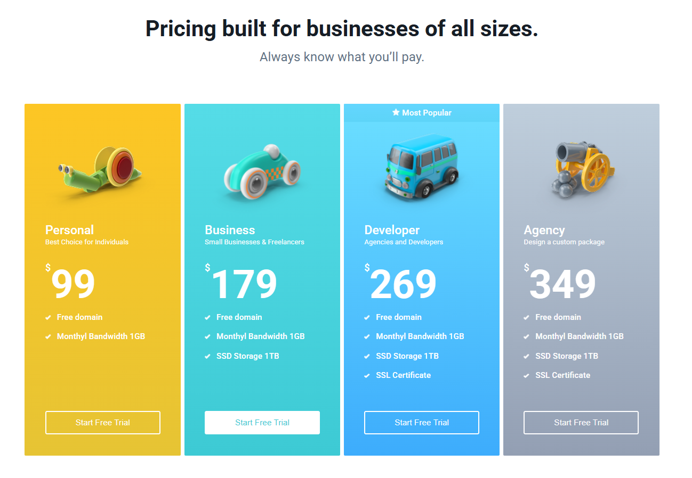

# 🛒 e-commerc-cards

Учебный / pet-project, выполненный в рамках курса **«Фронтенд-разработчик»** от **Яндекс Практикума**.

Проект представляет собой блок карточек тарифных планов для e-commerce-интерфейса с акцентом на вёрстку, визуальные эффекты и работу с CSS.

---

## 🔗 Репозиторий

GitHub:  
👉 git@github.com:raskum1984/e-commerc-cards.git

---

## 📸 Скриншот

> Скриншот демонстрирует desktop-версию интерфейса.

---

## 🚀 Используемые технологии

- HTML5
- CSS3
  - Flexbox
  - CSS Grid
  - CSS Custom Properties (переменные)
  - hover-эффекты
- БЭМ-нейминг
- Git / GitHub

---

## ✨ Особенности проекта

- Карточки тарифов с цветными фонами
- Универсальная кнопка, подходящая для разных карточек
- Работа с наложением слоёв (`z-index`)
- Hover-эффекты для карточек и кнопок
- Чистая и структурированная вёрстка

---

## 📱 Адаптивность

Интерфейс адаптирован под:
- desktop
- tablet
- mobile

Карточки корректно перестраиваются под разные размеры экрана.

---

## 📁 Структура проекта
├── fonts/ # шрифты
├── images/ # изображения и скриншоты
├── styles/ # CSS-стили
├── index.html # главная страница
└── README.md
